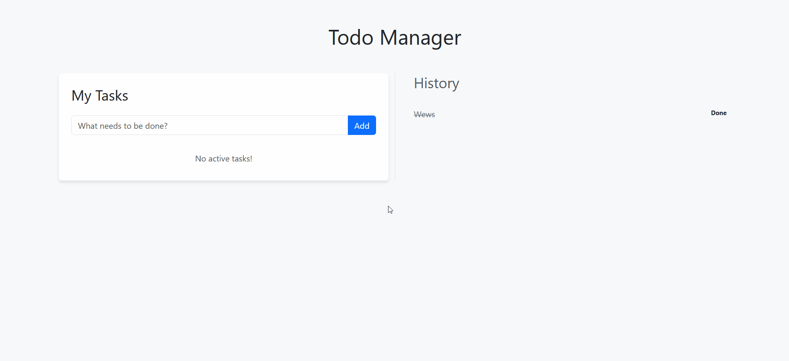

# Modern Todo Web App (Java 21 & HTMX)

A high-performance, "No-JS" interactive Todo application built as part of a technical internship challenge. This project demonstrates a transition from legacy Spring architectures to a modern, encapsulated, and persistent stack.

## 🚀 Demo

*Note: Record your app using ScreenToGif and save it as 'demo.gif' in this folder.*

## 🛠️ Tech Stack
- **Backend:** Java 21, Spring Boot 3.4.1 (Jakarta EE)
- **Database:** H2 (In-Memory Persistence)
- **Migration:** Liquibase (Database Version Control)
- **Frontend:** Thymeleaf + HTMX (Server-Side Interactivity without custom JavaScript)
- **Styling:** Bootstrap 5.3

## 🏗️ Architecture & Learning Journey
This project evolved through a strict "Architecture First" protocol:
1. **Legacy Modernization:** Upgraded from Spring Boot 1.2 to 3.4 to resolve Java 21 compatibility issues (Jakarta migration).
2. **Encapsulation:** Implemented a robust `Todo` model with private fields and public accessors.
3. **Persistence:** Configured Liquibase to manage the `todos` table (id, description, completed) automatically.
4. **HTMX Integration:** Used partial HTML fragment swapping (`hx-target`) to create a Single Page App (SPA) feel.

## 📋 Features
- **Active Task Management:** Add tasks via an HTMX-powered form.
- **State Persistence:** Completed tasks move to the "History" column and persist across restarts.
- **Responsive UI:** Clean, centered layout using Bootstrap 5.

## 🚦 How to Run
1. Ensure you have **Java 21** and **Maven** installed.
2. Clone the repository.
3. Run the following command in the terminal:
   ```bash
   mvn spring-boot:run
